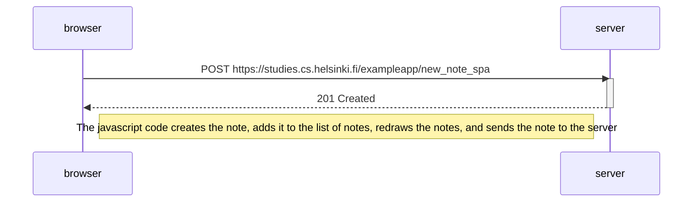

```mermaid
sequenceDiagram
    participant browser
    participant server
    
    browser->>server: POST https://studies.cs.helsinki.fi/exampleapp/new_note_spa
    activate server
    server-->>browser: 201 Created
    deactivate server

    Note right of browser: The javascript code creates the note, adds it to the list of notes, redraws the notes, and sends the note to the server
```
